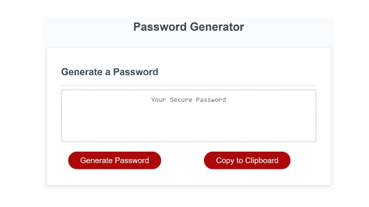
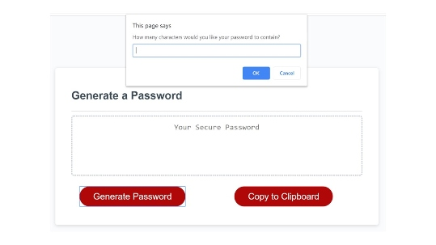
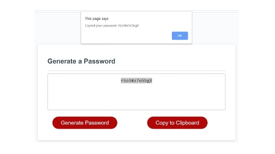

# Random Password Generator 

## Introduction:
Welcome to Random Password Generator a program created using various JavaScript techniques.  
The generator gives the user the ability to create a random password, with a specified length, based on their response to four (4) questions. Once the password is generated, the user has the ability to copy their password into another program of their choosing.

 

## Features
To initiate the generator, the user must click on the "Generate Password" button. A prompt will then ask the user how many characters they would like their password to contain.
The user can then proceed to specify which characters they would like to include.

The type of characters a user can select are:

* Lower case letters
* Capital letters
* Numbers (0-9)
* Symbols (ex. !@#$)
 
    *If the user does not specify, or does not enter a number between 8 and 128, the generator will alert them to put in the appropriate number.
 
 After the password is created, the user can then click the "Copy to Clipboard" button.

## Badges

## Preview

1. Password generator

2.  Question Prompt

3. Clipboard Function

